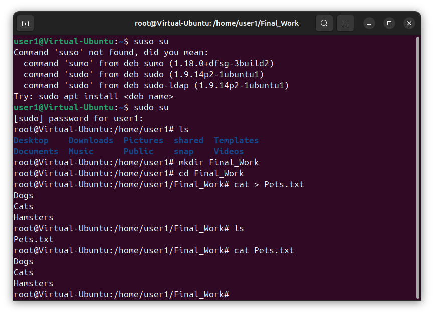

# Итоговая контрольная работа
# Система учёта животных в питомнике
## по блоку "Специализация - программист"
Выполнил Олег Нечибыло, гр. 6257

## Операционные системы и виртуализация (Linux)
### 1. Использование команды cat в Linux
При помощи команды cat создал файл Pets.txt и сделал записи о домашних животных.
```sh
sudo sudo
cat > Pets.txt
Dogs
Cats
Hamsters
```

При помощи команды cat создал файл PackAnimals.txt и сделал записи о вьючных животных.
```sh
sudo sudo
cat > PackAnimals.txt
Horses
Camels
Donkeys
```

Объединил содержимое файлов в новый файл Animals.txt
```sh
cat Pets.txt PackAnimals.txt > Animals.txt
```
Изменил имя файла
```shell
mv Animals.txt HumanFriends.txt
```

### 2. Работа с директориями в Linux
Создал новую директорию
```shell
mkdir "NewDirectory"
```
Переместил в неё файл HumanFriends.txt
```shell
mv HumanFriends.txt ./NewDirectory/HumanFriends.txt
```

### 3. Работа с MySQL в Linux
Выполнил установку MySQL в графической оболочке дистрибутива Ubuntu во время установки ОС
### 4. Управление deb-пакетами
Установка скачанного deb-пакета
```shell
dpkg -i /home/user1/Downloads/mysql-community-server_8.4.0-1ubuntu24.04_amd64.deb
```

Удаление установленного пакета
```shell
dpkg -r /home/user1/Downloads/mysql-community-server_8.4.0-1ubuntu24.04_amd64.deb
```

### 5. История команд в терминале Ubuntu
Скриншоты команд находятся в директории SсreenshotsLinux
## Объектно-ориентированное программирование
### 6. Диаграмма классов

### 7. Работа с MySQL
Создал базу данных
```shell
create database Human_Friends;
```
Ввел команду для дальнейшего использования базы данных
```shell
use Human_Friends;
```
Создал таблицу с данными о домашних животных
```shell
create table Pets(`ID` int auto_increment primary key,
 `Name` varchar(16) not null, Type varchar(16) not null,
 `BirthDate` date not null, `Commands` varchar(50));
```
Ввёл в таблицу данные о домашних животных
```shell
insert into Pets(`Name`, `Type`, `BirthDate`, `Commands`)
 values('Dog', 'Dog', '2020-12-11', 'Sit, Stay'),
	('Teftelka', 'Cat', '2022-09-11', 'Sit, Stay'),
    ('Phoma', 'Hamster', '2023-10-11', 'Sit, Stay'),
    ('Spot', 'Dog', '2020-10-16', 'Sit, Stay, Jump'),
    ('Thomas', 'Cat', '2023-01-11', 'Sit, Say Meow'),
    ('Fatty', 'Hamster', '2023-01-11', 'Sit, Stay, Roll'),
    ('Alex', 'Dog', '2020-12-11', 'Sit, Stay, Voice'),
    ('Garfield', 'Cat', '2020-10-01', 'Sit, Roll');
```
Вывел данные таблицы на экран
```shell
select * from Pets;
```


Выполнил выборку по собакам
```shell
select `ID`, `Name`, `BirthDate`, `Commands` from Pets 
where `Type` = 'Dog';
```

Выполнил выборку по кошкам
```shell
select `ID`, `Name`, `BirthDate`, `Commands` from Pets 
where `Type` = 'Cat';
```

Выполнил выборку по хомякам
```shell
select `ID`, `Name`, `BirthDate`, `Commands` from Pets 
where `Type` = 'Hamster';
```

Создал таблицу с данными о вьючных животных
```shell
create table PackAnimals(`ID` int auto_increment primary key,
 `Name` varchar(16) not null, Type varchar(16) not null,
 `BirthDate` date not null, `Commands` varchar(50));
```
Заполнил таблицу данными
```shell
insert into PackAnimals(`Name`, `Type`, `BirthDate`, `Commands`)
 values('Bucephalus', 'Horse', '2020-04-24', 'Walk, Run'),
	('Cherokee', 'Camel', '2021-01-01', 'Go, Stay'),
    ('Dumbo', 'Donkey', '2022-06-21', 'Go, Stay'),
    ('Stormie', 'Horse', '2023-03-22', 'Walk, Walk back, Run'),
    ('Caravan', 'Camel', '2020-11-11', 'Sit, Stand up, Go'),
    ('Donkey-Kong', 'Donkey', '2020-04-10', 'Go, Voice'),
    ('Speedey', 'Horse', '2022-5-15', 'Go, Run, Stay'),
    ('Big-Guy', 'Camel', '2019-08-25', 'Go, Stay');
```

Вывел данные из таблицы на экран
```shell
select * from PackAnimals;
```

Выполнил выборку по лошадям
```shell
select `ID`, `Name`, `BirthDate`, `Commands` from PackAnimals 
where `Type` = 'Horse';
```

Выполнил выборку по верблюдам
```shell
select `ID`, `Name`, `BirthDate`, `Commands` from PackAnimals 
where `Type` = 'Camel';
```

Выполнил выборку по ослам
```shell
select `ID`, `Name`, `BirthDate`, `Commands` from PackAnimals 
where `Type` = 'Donkey';
```

Выполнил выборку лошадей и ослов без верблюдов
```shell
select * from PackAnimals 
where `Type` != 'Camel';
```

Выполнил выборку животных, возрастом от 1 до 3 лет, с указанием возраста с точностью до месяца
```shell
select `Name`, `Type`, `BirthDate`, 
date_format(from_days(datediff(sysdate(), `BirthDate`)), '%y-%m') 
as `Age`, `Commands` from PackAnimals 
where datediff(sysdate(), `BirthDate`) < (365 * 3) 
and datediff(sysdate(), `BirthDate`) > 365 
union all 
select `Name`, `Type`, `BirthDate`, 
date_format(from_days(datediff(sysdate(), `BirthDate`)), '%y-%m') 
as `Age`, `Commands` from Pets 
where datediff(sysdate(), `BirthDate`) < (365 * 3) 
and datediff(sysdate(), `BirthDate`) > 365;
```

Выполнил выборку всех животных изо всех таблиц, с указанием исходной таблицы
```shell
select `Name`, 
'Pack Animal' as `Animal type`, `Type`, `BirthDate`, `Commands` from PackAnimals 
union 
select `Name`, 
'Pet' as `Animal type`, `Type`, `BirthDate`, `Commands` from Pets 
order by `Name`;
```

